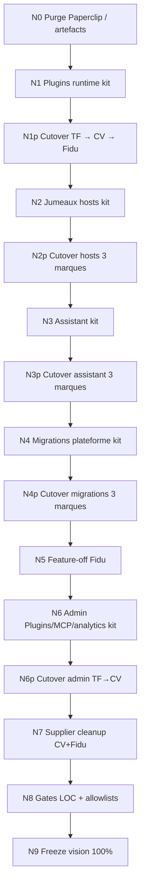

# Plan N* — Finir la vision post-M16 (~45–50 % → 100 %)

**Baseline HEAD (audit 2026-07-30)**  
kit `e4b23ec` (M16 freeze) · TF `3565524` · Certivan `e51b369` · Fidu `2cc207e`

**Règles non négociables** (héritées M0)  
Commun = `@creezio/*` uniquement · Marques = minimum métier · Stubs / façades /
jumeaux / fichiers plateforme = **NON done** · Extraire l’existant, ne pas
inventer · Tests verts → push → étape suivante · **Pas de N(n+1) si gate N(n)
rouge** · Sync vendor = **liste complète** · Cutover marques séquentiel `*p` :
TF → Certivan → Fidu (sauf N5 Fidu-only et N0 artefacts) · **Paperclip = mort**.

Phases livrées : [PHASE-N0.md](PHASE-N0.md) · [PHASE-N1.md](PHASE-N1.md) ·
[PHASE-N1p.md](PHASE-N1p.md) · [PHASE-N2.md](PHASE-N2.md) ·
[PHASE-N2p.md](PHASE-N2p.md) · suite N3→N9 ci-dessous.

---

## N0 — Purge artefacts (Paperclip build + Fidu git clean)

1. **Objectif** : zéro artefact Paperclip sur disque / WT ; Paperclip mort partout.
2. **Inclus** : purge `fidu/crm/build/electron/paperclip*` ; assert `.gitignore`
   `/build` ; assert TF/CV/Fidu sans `paperclip-*` src/build runtime.
3. **Exclu** : extraction code ; sync vendor ; republish.
4. **Tests gate** : kit `npm test` (incl. `test-phase-n0`) ; absents
   `paperclip-launcher` src/build 3 marques.
5. **Done** : [PHASE-N0.md](PHASE-N0.md).
6. **Effort S · Republish non**

---

## N1 — Runtime plugins Electron → kit ✅

1. **Objectif** : SoT spawn/discover/git/control-extras dans
   `@creezio/electron-shell`.
2. **Inclus** : extraction TF `plugin-runtime|launcher|git|control-extras` (+
   deps plateforme jumelles si pures) + `brand-bindings` / adapters / crm-key /
   accept-check / test-runner / data ; events+grants = réexport platform-core.
3. **Exclu** : UI Admin Plugins ; cutover marques (N1p).
4. **Tests gate** : `npm run build:packages && npm test` (+ `test-phase-n1`).
5. **Done** : [PHASE-N1.md](PHASE-N1.md) inventaire + LOC · baseline N0 `1aac0e2`.
6. **Effort L · Republish non**

---

## N1p — Cutover plugins runtime (TF → Certivan → Fidu) ✅

1. **Objectif** : jumeaux runtime absents ; imports `@creezio/electron-shell`.
2. **Inclus** : delete cutover ; `plugin-control-api` ≤40 LOC ou absent ; sync
   vendor liste complète.
3. **Exclu** : UI admin ; assistant ; meili-indexer.
4. **Tests gate** : par marque `sync-creezio-vendor` + `electron:compile` +
   `test:plugin-*` + `test:shell` ; kit `npm test`.
5. **Done** : [PHASE-N1p.md](PHASE-N1p.md) — TF `063ac3c` · CV `e463290` ·
   Fidu `2fd5a0f` ; baseline N1 `fadb3e4`.
6. **Effort L · Republish différé** (wiring electron, non packing)

---

## N2 — Jumeaux hosts → kit ✅

1. **Objectif** : SoT utilitaires host / ai-workspace / meili (+ embeds déjà B2)
   dans `@creezio/electron-shell` (+ canaux preload `@creezio/shell`).
2. **Inclus** : crash-reporter, web-telemetry, bridge-client, server-launcher ;
   ai-workspace (manager/actions/screencast/profile) ; meili (schema/coherence/indexer TF gold) ;
   embeds/sandbox déjà SoT platform-core / electron-shell (B2) documentés.
3. **Exclu** : cutover marques (N2p) ; seeds métier ; supplier-tabs ; assistant ; migrations.
4. **Tests gate** : `npm run build:packages && npm test` (+ `test-phase-n2`).
5. **Done** : [PHASE-N2.md](PHASE-N2.md) · baseline N1p `16b61f7`.
6. **Effort L · Republish non**

---

## N2p — Cutover hosts (TF → Certivan → Fidu) ✅

1. **Objectif** : jumeaux host plateforme absents ; imports
   `@creezio/electron-shell` / `@creezio/platform-core` ; preload mince.
2. **Inclus** : delete cutover ; `host-n2-bindings` ; host-stack kit ; preload
   `createDesktopApi`+esbuild ≤260 LOC ; Meili TF = hooks kit ; CV/Fidu =
   indexeurs métier conservés ; sync vendor liste complète.
3. **Exclu** : assistant (N3) ; seeds métier hors bindings ; packing/republish.
4. **Tests gate** : par marque `electron:compile` + hermes/n8n/shell (+
   ai-workspace) + `build` ; kit `npm test` (+ `test-phase-n2p`).
5. **Done** : [PHASE-N2p.md](PHASE-N2p.md) — TF `b602b08` · CV `7e5bfa6` ·
   Fidu `393bb98` ; baseline N2 `9f44eb6`.
6. **Effort L · Republish différé** (wiring electron, non packing)

---

## N3 — Assistant marque → `@creezio/assistant` ✅

1. **Objectif** : runtime+UI génériques SoT `@creezio/assistant` ; extension
   AppMap / Prompts / BrandTools.
2. **Inclus** : extraction TF gold (~11 kLOC) ; `configureAssistantBrand` ;
   UI `@creezio/assistant/ui`.
3. **Exclu** : panier/dispatch/relevés ; cutover marques (N3p) ; assistant-chat
   orchestration métier.
4. **Tests gate** : `npm run build -w @creezio/assistant` + `npm test`
   (`test-phase-n3`).
5. **Done** : [PHASE-N3.md](PHASE-N3.md) · baseline N2p `4f37a9e`.
6. **Effort L · Republish non**

---

## N3p — Cutover assistant (TF → CV → Fidu) ✅

1. **Objectif** : jumeaux UI/runtime absents ; mounts brand ≤2000 LOC.
2. **Inclus** : configure-brand ×3 ; delete générique ; chat-db façade ≤80 ;
   sync vendor liste complète.
3. **Exclu** : migrations (N4) ; admin plugins ; supplier-tabs.
4. **Tests gate** : assistant-routing + active-surface + electron:compile + build
   ×3 ; kit `test-phase-n3p`.
5. **Done** : [PHASE-N3p.md](PHASE-N3p.md) — TF `cfd4a49` · CV `49d39be` ·
   Fidu `e9542f5` ; baseline N3 `863406f` / `a358d5b`.
6. **Effort L · Republish non** (packing inchangé)

---

## N4 — Migrations historiques plateforme → kit ✅

1. **Objectif** : steps plateforme `electron/migrations` SoT
   `@creezio/platform-core` (`platformHistoricalMigrations`) ; inventaire
   classé ; gaps migrate-legacy.
2. **Inclus** : 16 steps TF gold (017, 020, 022–035) + runner + types ;
   filtre colonnes migrate-legacy ; harness fixture.
3. **Exclu** : cutover marques (N4p) ; steps métier ; 021 hermes (métier TF).
4. **Tests gate** : `npm run build -w @creezio/platform-core` + `npm test`
   (`test-phase-n4`).
5. **Done** : [PHASE-N4.md](PHASE-N4.md) · baseline N3p `369a7bf`.
6. **Effort M · Republish non**

---

## N4p — Cutover migrations (TF → CV → Fidu) ✅

1. **Objectif** : steps plateforme absents (ou wraps Fidu) ; runner ≤150 LOC.
2. **Inclus** : delete/wrap cutover ×3 ; sync vendor liste complète.
3. **Exclu** : rewrite métier ; N5 feature-off.
4. **Tests gate** : database-module TF/CV ; `test:fidu` ; kit `test-phase-n4p`.
5. **Done** : [PHASE-N4p.md](PHASE-N4p.md) — TF `37ea6e6` · CV `da7e356` ·
   Fidu `1763332` ; baseline N4 `b2234b9`.
6. **Effort M · Republish oui** Fidu (boot DB packaged)

---

## N5 — Feature-off Fidu (`host-na-stubs` → contrat kit) ✅

1. **Objectif** : stubs locaux absents ; contrat kit `createFeatureOffHost` ;
   manifeste `features.plugins=false` / `fleet=false`.
2. **Inclus** : `feature-off-host.ts` (signatures ex-`host-na-stubs`) ;
   `BrandFeatures` ; cutover Fidu host-stack ; **delete** `host-na-stubs.ts`.
3. **Exclu** : activer plugins Fidu ; TF/CV (hosts réels).
4. **Tests gate** : kit `test-phase-n5` ; Fidu `electron:compile` +
   `test:shell` + `test:phase-c5` ; `test ! -f host-na-stubs.ts`.
5. **Done** : [PHASE-N5.md](PHASE-N5.md) — kit `de903b2` · Fidu
   `20d9adf` / release `cf87426` (**0.1.62**) ; baseline N4p `5dca2bb`.
6. **Effort S · Republish oui** Fidu

---

## N6 — Admin Plugins / MCP / analytics génériques → kit ✅

1. **Objectif** : UI + handlers génériques TF (admin plugins, mcp-admin,
   usage-analytics) SoT kit ; zéro agregateurs/data-mapping.
2. **Inclus** : `product-hub/ui` + `mcp-facade` admin + `observability` usage ;
   adapters injectables ; demobrand I5 ACL inchangé.
3. **Exclu** : cutover marques (→ N6p) ; tool-registry métier ; Fidu admin.
4. **Tests gate** : kit `test-phase-n6` (+ `npm test`).
5. **Done** : [PHASE-N6.md](PHASE-N6.md) — kit `e4ec7fb` ;
   baseline N5 `b818804`.
6. **Effort M · Republish non**

---

## N6p — Cutover admin (TF → CV) ✅

1. **Objectif** : jumeaux UI/libs admin absents ; mounts pages ≤80 LOC ;
   façades `@creezio/product-hub|mcp-facade|observability` (+ `/ui`).
2. **Inclus** : delete clients locaux ; brand-*-host ; routes kit ;
   sync vendor liste complète TF+CV ; kit UI `../dist` + `AdminPluginDetail`.
3. **Exclu** : Fidu admin ; agregateurs / data-mapping ; tool-registry métier.
4. **Tests gate** : build + electron:compile + plugin-acl-l3 + plugin-sidebar
   ×2 ; kit `test-phase-n6p`.
5. **Done** : [PHASE-N6p.md](PHASE-N6p.md) — TF `c85bb0f` · CV `08a02b1`.
6. **Effort M · Republish** vendor sync (pas d’exe Fidu)

---

## N7 — `supplier-tabs` hors métier Certivan / Fidu ✅

1. **Objectif** : jumeaux manager/driver absents (façades) sur CV+Fidu ;
   SoT `@creezio/electron-shell` `host/browser-tabs` ; TF métier local.
2. **Inclus** : extract gold TF ; `configureBrowserTabs` ; façades CV/Fidu ;
   delete helpers locaux tab-url/load-state ; sync vendor.
3. **Exclu** : rewrite navigateur métier TF ; delete capability onglets CV.
4. **Tests gate** : electron:compile + build CV ; build + test:fidu ;
   kit `test-phase-n7`.
5. **Done** : [PHASE-N7.md](PHASE-N7.md) — CV `51c7c22` · Fidu `5e5367d` / 0.1.63.
6. **Effort M · Republish oui** Fidu (+ vendor CV)

---

## N8 — Gates LOC + allowlists vision ✅

1. **Objectif** : budgets LOC mesurables ×3 + forbidden jumeaux/clients ;
   gate permanent `test-phase-n8`.
2. **Inclus** : ceilings main/preload/runner/façades ; supplier TF≥400 /
   CV+Fidu≤40 ; Paperclip mort.
3. **Exclu** : rewrite métier ; republish.
4. **Tests gate** : kit `npm test` (`test-phase-n8`).
5. **Done** : [PHASE-N8.md](PHASE-N8.md) — kit `b522876`.
6. **Effort M · Republish non**

---

## N9 — Freeze vision 100 % ✅

1. **Objectif** : matrice + PLAN-N + SHAs gold ; dry-run sync ×3 ; freeze.
2. **Inclus** : [PHASE-N9.md](PHASE-N9.md) ; update MATRICE ; `test-phase-n9`.
3. **Exclu** : republish ; rewrite métier.
4. **Tests gate** : kit `npm test` ; dry-run sync TF/CV/Fidu.
5. **Done** : [PHASE-N9.md](PHASE-N9.md) — TF `c85bb0f` · CV `51c7c22` ·
   Fidu `5e5367d` / **0.1.63**.
6. **Effort S · Republish non**

---

## Flowchart

---

## Engagement process

- **Pas de N(n+1) si gate N(n) rouge.**
- Push GitHub kit + marque touchée après chaque étape verte.
- Sync vendor = liste complète.
- Extraire TF (gold) ; ne pas inventer.
- Stubs / façades / jumeaux = **NON done**.
- Paperclip = mort — ne jamais réintroduire.
