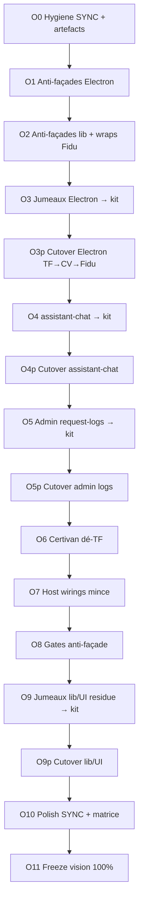

# Plan O* — Fermer les dettes vision post-N9 (~65 % → 100 %)

**Baseline HEAD (audit 2026-07-30)**  
kit `3826e30` (docs N9) / tip fonctionnel `49f1bd1` · TF `c85bb0f` · Certivan
`51c7c22` · Fidu `5e5367d`

**Constat chiffré (relire HEAD, pas inventer)**  

| Dette | Preuve mesurable |
|--------|------------------|
| Jumeaux TF↔CV ≥85 % | **138** fichiers · ~**28 kLOC** (lib+server+electron+app) |
| dont electron (hors supplier-tabs TF) | **34** fichiers · ~**5,4 kLOC** |
| Façades mince (re-export) | TF/CV ~**21** · Fidu ~**13** (supplier, `plugin-control-api`, `mcp-admin`, `chat-db`, `usage-analytics*`, wraps migr.…) |
| `assistant-chat.ts` | TF/CV **0,98** · TF/Fidu **0,89** · ~**1955 LOC** ×3 |
| Admin request-logs | clients **1,00** ×3 · lib/middleware ~**0,93–1,00** |
| CV fork catering | steps **006–021** (+ `001_base`) encore dans `MIGRATIONS` legacy + queries |
| Host gras | `host-stack` 204–241 · `host-runtime-ctx` 116–246 · `preload-app` **259** (= plafond N8) |
| Hygiene | Fidu `build/electron/host-na-stubs.js` résiduel ; SYNC.json sans pin SHA kit tip |

**Règles non négociables**  
Commun = `@creezio/*` uniquement · Marques = minimum métier ·
**Façades / stubs / jumeaux = NON done** (même ≤40 LOC — N* validait, O* refuse) ·
Extraire l’existant · Tests verts → push → étape suivante ·
**Pas de O(n+1) si gate O(n) rouge** · Cutover `*p` séquentiel TF → Certivan →
Fidu (sauf O0 / O6 CV-only / O10–O11) · Paperclip = mort ·
**Pas de domaine métier TF (fournisseur / panier / relevé…) dans packages natifs** —
capacités génériques (`external` / site externe) ; labels & routes = config marque
([ADR-no-brand-domain-in-native-packages.md](ADR-no-brand-domain-in-native-packages.md)).

Phases livrées : [PHASE-O0.md](PHASE-O0.md) · [PHASE-O1.md](PHASE-O1.md) ·
[PHASE-O2.md](PHASE-O2.md) · [PHASE-O3.md](PHASE-O3.md) ·
[PHASE-O3p.md](PHASE-O3p.md) · [PHASE-O4.md](PHASE-O4.md) ·
[PHASE-O4p.md](PHASE-O4p.md) · [PHASE-O5.md](PHASE-O5.md) ·
[PHASE-O5p.md](PHASE-O5p.md) · [PHASE-O6.md](PHASE-O6.md) ·
[PHASE-O7.md](PHASE-O7.md) · [PHASE-O8.md](PHASE-O8.md) ·
[PHASE-O9.md](PHASE-O9.md) · [PHASE-O9p.md](PHASE-O9p.md) ·
[PHASE-O10.md](PHASE-O10.md) · [PHASE-O11.md](PHASE-O11.md).

---

## O0 — Hygiene SYNC dirty + polish ✅

1. **Objectif** : baseline O* propre ; vendor/SYNC/artefacts alignés tip kit ;
   zéro résidu Paperclip / stubs build.
2. **Inclus** : inventaire dettes O*, pin `kitSha` dans sync script + docs,
   purge `host-na-stubs` build, `test-phase-o0`.
3. **Exclu** : extraction code ; delete façades ; rewrite métier.
4. **Tests gate** : kit `npm test` (+ `test-phase-o0`) ; dry-run sync ×3 ;
   `host-na-stubs` src/build absents.
5. **Done** : [PHASE-O0.md](PHASE-O0.md).
6. **Effort S · Republish non**

---

## O1 — Anti-façades Electron mince (supplier + plugin-control-api) ✅

1. **Objectif** : plus aucun fichier marque qui ne fait que re-exporter le kit
   Electron (browser-tabs / plugin-control).
2. **Inclus** : `supplier-tabs|driver|preload-supplier` (CV+Fidu) ;
   `plugin-control-api` (×3). **Exclu** : supplier métier TF ; host-stack ;
   mcp-admin lib.
3. **Travaux** : kit exports stables + `test-phase-o1` ; cutover TF → CV → Fidu ;
   delete façades ; sync vendor liste complète.
4. **Tests gate** : `npm test` ; `electron:compile` ×3 ; fichiers absents ;
   TF `supplier-tabs` ≥400 LOC métier.
5. **Done** : [PHASE-O1.md](PHASE-O1.md).
6. **Effort S · Republish non**

---

## O2 — Anti-façades lib admin + chat-db + wraps migrations Fidu ✅

1. **Objectif** : plus de re-exports `mcp-admin` / `usage-analytics*` /
   `assistant/chat-db` ; plus de wraps Fidu `platformHistoricalMigrations`
   en fichiers step.
2. **Inclus** : façades lib × marques ; wraps migr. Fidu. **Exclu** :
   `brand-*-host` (O7) ; UI request-logs (O5).
3. **Travaux** : gate kit ; cutover TF → CV → Fidu ; fusion wraps →
   `platform-compose` ; sync ; build ; republish Fidu.
4. **Tests gate** : `test-phase-o2` ; build×3 ; `test:fidu` ; 0 wraps `.find`
   dans `steps/`.
5. **Done** : [PHASE-O2.md](PHASE-O2.md).
6. **Effort M · Republish oui Fidu**

---

## O3 — Jumeaux Electron plateforme → kit ✅

1. **Objectif** : SoT unique des near-copies Electron TF↔CV encore locaux.
2. **Inclus** : gold TF (`paths`, `connection-profile`, `recovery-key`,
   `n8n-api-key`, `oauth-loopback`, `agent-isolation`, `assistant-chrome`,
   `profile-picker-html`, `factory-reset`, `licensing`, …) →
   `@creezio/electron-shell` / `platform-core`.
3. **Exclu** : cutover (O3p) ; `main.ts` métier ; migrations catering CV ;
   host-stack (O7).
4. **Tests gate** : `npm run build:packages && npm test` (`test-phase-o3`).
5. **Done** : [PHASE-O3.md](PHASE-O3.md).
6. **Effort L · Republish non**

---

## O3p — Cutover jumeaux Electron (TF → CV → Fidu) ✅

1. **Objectif** : jumeaux Electron absents ; imports `@creezio/*` directs.
2. **Inclus** : delete liste O3 ×3 ; sync vendor. **Exclu** : supplier TF ;
   host-stack/preload (O7) ; CV catering SQL (O6).
3. **Tests gate** : compile + smokes recovery/connection/n8n-api-key ×3 ;
   `test-phase-o3p`.
4. **Done** : [PHASE-O3p.md](PHASE-O3p.md).
5. **Effort L · Republish différé**
6. **SHAs** : TF `c8fb984` · CV `3499243` · Fidu `69f0a5b`

---

## O4 — `assistant-chat` générique → `@creezio/assistant` ✅

1. **Objectif** : orchestration chat SSE/tools générique SoT kit.
2. **Inclus** : extraction TF `assistant-chat.ts` (~1957 LOC) + hooks
   `auth` / `BrandTools.executeTool` / hermes work. **Exclu** : cutover
   (O4p) ; prompts/sql-tools métier ; panier/tasks en kit.
3. **Tests gate** : `npm run build -w @creezio/assistant && npm test`
   (`test-phase-o4`).
4. **Done** : [PHASE-O4.md](PHASE-O4.md).
5. **Effort L · Republish non**

---

## O4p — Cutover `assistant-chat` (TF → CV → Fidu) ✅

1. **Objectif** : **0** `assistant-chat.ts` local ; mounts brand mince.
2. **Inclus** : delete + imports `@creezio/assistant` ; sync. **Exclu** :
   rewrite prompts métier.
3. **Tests gate** : build×3 + smokes assistant-routing / active-surface ;
   `test-phase-o4p`.
4. **Done** : [PHASE-O4p.md](PHASE-O4p.md).
5. **Effort M · Republish non**
6. **SHAs** : TF `92a03f3` · CV `1e97e72` · Fidu `f6d0fb8`
7. **Note O4r** : le wiring `brand-chat-tools` / `BrandTools.executeTool` de
   O4p est **supersédé** — voir O4r + [ADR-assistant-tools-mcp.md](ADR-assistant-tools-mcp.md).

---

## O4r — Remédiation assistant tools → MCP / kit ✅

1. **Objectif** : **0** `brand-chat-tools.ts` ; métier = discovery MCP ;
   tasks = adapter kit ; defs plateforme SoT kit.
2. **Inclus** : bridge `mcp` / `tasks` dans `@creezio/assistant` ; cutover ×3 ;
   ADR. **Exclu** : O7 host-stack ; unifier Hono `/mcp` handlers (dette).
3. **Tests gate** : `test-phase-o4r` + routing/active-surface ×3.
4. **Done** : [PHASE-O4r.md](PHASE-O4r.md) · [ADR-assistant-tools-mcp.md](ADR-assistant-tools-mcp.md).
5. **Effort L · Republish non**

---

## O4r2 — Un registre MCP unique (façade marque) ✅

1. **Objectif** : assistant + Electron partagent `create*BrandMcp` /
   `create*ModuleMcpTools` ; **0** handlers métier dans `mcp-bridge`.
2. **Inclus** : `modules/brand-mcp.ts` ×3 ; Next `brand-module-api` ; Fidu
   `module.accounting.query` dans le registre Electron ; ADR. **Exclu** :
   O7 host-stack ; unifier handlers Hono `/mcp` legacy ; entitySources JSON.
3. **Tests gate** : `test-phase-o4r2` + routing/active-surface ×3.
4. **Done** : [PHASE-O4r2.md](PHASE-O4r2.md) · [ADR-assistant-tools-mcp.md](ADR-assistant-tools-mcp.md).
5. **Effort M · Republish non**

---

## O4r3 — Unifier Hono `/mcp` → même factory ✅

1. **Objectif** : Hono `/mcp` consomme `create*BrandMcp` via
   `bindFacadeToolsToHono` ; **0** handlers métier dupliqués pour tools
   déjà dans la façade.
2. **Inclus** : kit `hono-bind` ; cutover TF (gold mounts Next) → CV → Fidu ;
   ADR. **Exclu** : O7 ; entitySources (O4r4) ; extraction complète GED Fidu.
3. **Tests gate** : `test-phase-o4r3` + routing/active-surface ×3 ; TF `test:phase-d1`.
4. **Done** : [PHASE-O4r3.md](PHASE-O4r3.md) · [ADR-assistant-tools-mcp.md](ADR-assistant-tools-mcp.md).
5. **Effort L · Republish non**

---

## O4r4 — Projections assistant déclaratives ✅

1. **Objectif** : `entitySources` / `formatSearchHit` = moteur kit + règles
   marque ; **0** switch `kind` TS ×3.
2. **Inclus** : `createEntitySourcesFromRules` / `createFormatSearchHit` ;
   cutover ×3. **Exclu** : `argsPreview` (reste marque, non bloquant) ; O7.
3. **Tests gate** : `test-phase-o4r4` + routing/active-surface ×3.
4. **Done** : [PHASE-O4r4.md](PHASE-O4r4.md).
5. **Effort S · Republish non**

---

## O5 — Admin request-logs / api-endpoints → kit ✅

1. **Objectif** : clients + middleware génériques SoT
   `@creezio/observability` / `product-hub` (package le plus proche).
2. **Inclus** : extraction gold TF admin logs/endpoints. **Exclu** : cutover
   (O5p) ; agregateurs métier.
3. **Tests gate** : `build:packages && npm test` (`test-phase-o5`).
4. **Done** : [PHASE-O5.md](PHASE-O5.md).
5. **Effort M · Republish non**

---

## O5p — Cutover admin logs (TF → CV → Fidu) ✅

1. **Objectif** : **0** clients request-logs / api-endpoints locaux.
2. **Inclus** : delete + mounts ≤80 LOC ; sync. **Exclu** : Fidu admin hors
   surface si N/A.
3. **Tests gate** : build×3 ; `test-phase-o5p`.
4. **Done** : [PHASE-O5p.md](PHASE-O5p.md).
5. **Effort M · Republish non**
6. **SHAs** : TF `2203a41` · CV `a7b96b3` · Fidu `8009aed`

---

## O6 — Certivan dé-TF (migrations / queries catering) ✅

1. **Objectif** : CV sans fork catering TF actif ; queries métier only.
2. **Inclus** : politique legacy tombstone / drop (extraite existant) ;
   delete libs catering mortes. **Exclu** : TF ; Fidu.
3. **Tests gate** : CV build + electron:compile + database-module ;
   `test-phase-o6`.
4. **Done** : [PHASE-O6.md](PHASE-O6.md).
5. **Effort L · Republish oui Certivan** (si DB packaged)

---

## O7 — Host wirings mince (host-stack / ctx / preload) ✅

1. **Objectif** : wirings marque = composition mince du kit.
2. **Inclus** : plafonds `host-stack` ≤80 · `host-runtime-ctx` ≤100 ·
   `preload-app` ≤120 ; fusion `brand-*-host` → 1 fichier.
3. **Exclu** : supplier TF ; rewrite `brand-desktop-runtime` inventé.
4. **Tests gate** : wc -l ×3 ; embeds/shell ; `test-phase-o7`.
5. **Done** : [PHASE-O7.md](PHASE-O7.md).
6. **Effort L · Republish oui** (marques packing)

---

## O8 — Gates anti-façade permanents (remplace indulgence N8) ✅

1. **Objectif** : N8 autorisait façades ≤40 LOC — O8 les **interdit**.
2. **Inclus** : `test-phase-o8` forbidden re-export + ceilings O7. **Exclu** :
   rewrite métier TF supplier.
3. **Tests gate** : `npm test` (`test-phase-o8`).
4. **Done** : [PHASE-O8.md](PHASE-O8.md).
5. **Effort S · Republish non**

---

## O9 — Jumeaux lib/UI plateforme restants → kit ✅

1. **Objectif** : absorber near-copies plateforme TF↔CV restantes.
2. **Inclus** : inventaire post-O3/O5 → extract kit. **Exclu** : cutover
   (O9p) ; métier panier/RTI/GED.
3. **Tests gate** : `build:packages && npm test` (`test-phase-o9`).
4. **Done** : [PHASE-O9.md](PHASE-O9.md).
5. **Effort L · Republish non**

---

## O9p — Cutover jumeaux lib/UI (TF → CV → Fidu) ✅

1. **Objectif** : absents locaux ; imports `@creezio/*`.
2. **Inclus** : delete liste O9 ×3 ; labels métier via brand (`configure*` /
   i18n) — **pas** de re-promotion « fournisseur » comme API kit.
3. **Exclu** : republish (O11).
4. **Tests gate** : build×3 ; `test-phase-o9p`.
5. **Done** : [PHASE-O9p.md](PHASE-O9p.md).
6. **Effort M · Republish non**
7. **Prérequis intention** : [ADR-no-brand-domain-in-native-packages.md](ADR-no-brand-domain-in-native-packages.md)
8. **SHAs** : kit `ae00f6e` · TF `a78cada` · CV `49480ba` · Fidu `28968f8`

---

## O10 — Polish SYNC + matrice + allowlists métier ✅

1. **Objectif** : hygiene finale pré-freeze ; matrice = vérité O* ; SYNC pin.
2. **Inclus** : MATRICE, SYNC `kitSha`, allowlists. **Exclu** : code produit.
3. **Tests gate** : `test-phase-o10` ; dry-run ×3.
4. **Done** : [PHASE-O10.md](PHASE-O10.md).
5. **Effort S · Republish non**

---

## O11 — Freeze plan O* (vision honnête) ✅

1. **Objectif** : geler O0→O11 (gates + SHAs + feeds) **sans** proclamer
   100 % cosmétique ; checklist vision honnête (~**76 %** intention).
2. **Inclus** : [PHASE-O11.md](PHASE-O11.md), SHAs gold, `test-phase-o11`,
   republish TF/CV/Fidu (runtime O7/O9p).
3. **Tests gate** : `npm test` o0…o11 ; dry-run ×3 ; republish feeds verts.
4. **Done** : [PHASE-O11.md](PHASE-O11.md).
5. **Effort S · Republish oui** (marques touchées)
6. **Note** : façades ciblées O1–O8 = mort ; jumeaux résiduels / GED Fidu /
   argsPreview / vocabulaire TF kit = **dettes documentées**, hors done.

---

## Flowchart

---

## Chemin critique

`O0 → O1 → O2 → O3 → O3p → O4 → O4p → O5 → O5p → O6 → O7 → O8 → O9 → O9p → O10 → O11`

- **Bloquant données** : O6 (CV legacy).
- **Bloquant desktop** : O2 (Fidu migr wraps) + O7 (preload/host).
- **Plus gros volume** : O3/O3p + O4 + O9/O9p.
- **Parallélisation** : aucune ; `*p` jamais avant kit vert.

---

## Engagement process

- **Pas de O(n+1) si gate O(n) rouge.**
- Push GitHub kit + marque touchée après chaque étape verte.
- Sync vendor = **liste complète** ; pin SHA kit dès O0/O10.
- Extraire TF gold ; **ne pas inventer**.
- Façade / stub / jumeau / wrap = **NON done** — même ≤40 LOC.
- Paperclip = mort — ne jamais réintroduire.
- Republish : O2 (Fidu), O6 (CV si packing), O7 (marques packing), O11
  regroupement feeds.
